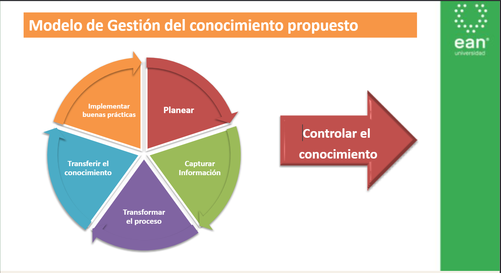

### Propuesta de un modelo de gestión del conocimiento que fortalezca los procesos de la línea de software del SENA Neiva

**Idea principal:** La idea principal de la propuesta en general es generar una herramienta / procesos para fortaleces los procesos de la linea de software (en cuanto a conocimientos se refiere), el conocimiento dejaria de depender de las personas logrando que a pesar de que se retire de la institucion el conocimiento siga almacenado basandose en el modelo Open Access.
    **Sintesis analisis general:** No es suficiente producir conocimiento; las instituciones deben contar con mecanismos organizados para almacenarlo, preservarlo, difundirlo y reutilizarlo.

**Gira en torno a:** Repositorios 

------------------------------------------------------------------

### Problematica

1. El aislamiento:
    - No existe ninguna bitacora de procesos.
    - No hay manera de identificar lecciones aprendidas.

2. Ejecucion:
    Los procesos se encuentran aislados, se lleva un aprendizaje sin unificar debido a que los instructores actuan de acuerdo a su experiencia previa, esto mas la gran cantidad de informacion que no se usa genera que no se pueda llevar un control de las lecciones aprendidas y relentiza los procesos de conocimiento.

    - Guia de aprendizaje y material de apoyo sin unificar.
    - Instructores actuan de acuerdo a la experiencia.
    - Capital de informacion sin usar.

3. Evaluacion:
    No hay centros de data en los que consultar proyectos desarrollados.

    - Los proyectos desarrollados son inaccesibles.
    - No existen herramientas que permitan gestionar el conocimiento.

Todo esto genera que los aprendices, instructores y administrativos creen conocimiento, pero este no aproveche.
Esto abre la oportunidad de crear herramientas para desarrollar el conocimiento.

------------------------------------------------------------------

### ¿Cual fue el Proceso para Desarrollarlo?

- Se realizo un analisis de como se gestiona el conocimiento en el CIES en la linea de desarrollo de software (se cerro el muestreo para ser mas concreto).
- Se identificaron los modelos de gestion del conocimiento desarrollados.
- Definir los procesos requeridos para el diseño de un modelo de gestión del conocimiento.
- Diseñar el modelo de gestión del conocimiento para la línea de desarrollo de software.
- Establecer el plan de implementación del modelo gestión del conocimiento para la línea de desarrollo de software.

------------------------------------------------------------------

### Grado de Madures

| **Estado Actual** | **Estado Futuro - Corto** | **Estado Futuro - Mediano** | **Estado Futuro - Largo** |
|-------------------|---------------------------|-----------------------------|---------------------------|
| - Los colaboradores están interesados por gestionar el conocimiento; sin embargo, no existe un lineamiento que lo estandarice. - Existe la cultura de utilizar los recursos tecnológicos disponibles. | - Identificar el capital físico, lógico e intelectual disponible. - Diseñar un repositorio institucional. - Ejecutar planes de capacitación. | - Mejorar la infraestructura tecnológica. - Incentivar el crecimiento educativo en los colaboradores. - Desarrollar nuevos productos o servicios. | - Considerar la gestión del conocimiento como hábito para ejecutar los procesos. - Compartir el conocimiento para alcanzar propuestas en equipo. - Evaluar los procesos a través de la memoria del conocimiento. - El conocimiento es un hábito para el colaborador como ruta de crecimiento. |

------------------------------------------------------------------

### Modelo de Gestion del Conocimiento Propuesto

------------------------------------------------------------------

### Como Operativisar el Proyecto

------------------------------------------------------------------

### Conclusiones y Recomendaciones

- La gestión del conocimiento es una práctica que le permite a la organización explotar el capital intelectual.
- El modelo de gestión del conocimiento propuesto ayuda a crear mecanismos que gestione la información, permitiendo innovar en los procesos de la Entidad.
- El capital del conocimiento se robustece a través del compromiso de todos los colaboradores que intervienen en el proceso. 
- Se considera necesario diseñar herramientas que permitan capturar, sistematizar y socializar el conocimiento que se produce en la línea de desarrollo de software.
- La línea de desarrollo de software podrá desarrollar sistemas de información y bases de datos que le permitan explotar el conocimiento que producen.